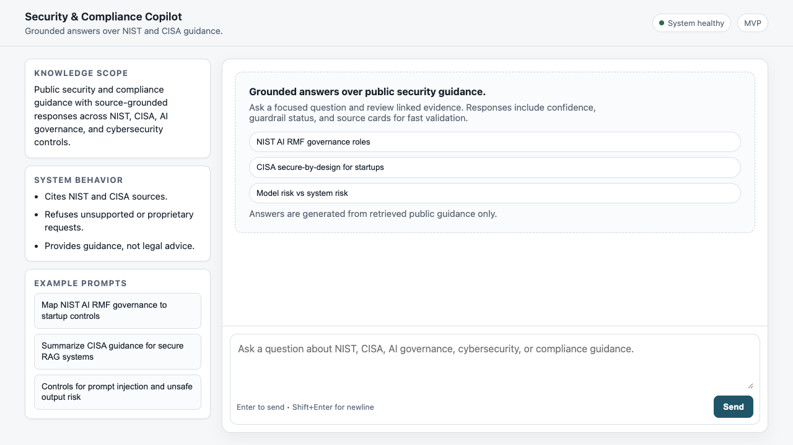

# Security & Compliance Copilot

[](https://github.com/giselleevita/security-compliance-copilot/actions/workflows/ci.yml)


Security & Compliance Copilot is a RAG reference implementation for security and compliance guidance. It answers questions from a tightly curated corpus of official public NIST and CISA material, returns grounded answers with citations, and fails closed when a request is unsafe or the evidence is weak.

> **This project does not enforce runtime security policies.** It provides grounded governance assistance using cited retrieval and offline evaluation. Runtime enforcement belongs in [agent-security-gate](https://github.com/giselleevita/agent-security-gate).

The implementation focuses on reviewable behavior across retrieval, reranking, guardrails, evaluation, and audit.



## Reviewer Quick Start

For a fast technical review:

1. Read [`docs/architecture.md`](docs/architecture.md) for component and trust boundaries.
2. Run `pytest tests/ -v --tb=short` to verify retrieval, guardrail, citation, and API behavior.
3. Run the offline evaluation suite to inspect refusal and retrieval metrics.
4. Review `SECURITY.md` and `SECURITY_AND_COMPLIANCE.md` for dependency exceptions,
   known limitations, and control mapping.

The main engineering signal is controlled RAG behavior: a constrained corpus,
retrieval-grounded responses, stable citations, fail-closed guardrails, audit
events, and regression evaluation.

## Offline evaluation results

Run the regression suite (no live LLM API required for retrieval/guardrail checks when using offline fixtures):

```bash
python evals/run_eval.py
```

| Category | Cases | What it measures |
|---|---:|---|
| `safe_answer` | 2+ | Grounded answers with citation precision |
| `retrieval_precision` | 2+ | MRR, nDCG@5, retrieval hit rate |
| `refusal` | 4+ | Fail-closed on unsafe / proprietary requests |
| `injection` | 4+ | Prompt injection and jailbreak resistance |
| `privacy` | 2+ | PII / sensitive data handling |

**Vector store:** Chroma (local demo) — production path documented for OpenAI embeddings; pgvector migration planned for multi-tenant deployments.

**CI:** Eval thresholds enforced in `.github/workflows/ci.yml` — see `evals/questions.json` for per-case gates (`min_citation_precision`, `min_faithfulness`, `expected_guardrail_status`).

## Why This Project

Most demo RAG apps optimize for answer quality first. This project is intentionally built around engineering controls first:

- constrained public corpus instead of open-ended web answers
- retrieval-first responses with explicit evidence handling
- guardrails for unsafe, proprietary, and prompt-leak requests
- stable citations tied to retrieved sources
- JSONL audit logging on every chat request
- offline evals for safe, injection, privacy, and refusal behavior

## Key Features

- Grounded answers over official public NIST and CISA guidance
- Retrieval pipeline with query rewriting, vector retrieval, cross-encoder reranking, and context building
- Stable inline citations tied to actual retrieved sources
- Guardrails for prompt injection, jailbreaks, prompt leaks, and proprietary-text requests
- JSONL audit logging for every chat request
- Offline evals with retrieval, citation, faithfulness, and refusal metrics

## What This Demonstrates

- practical RAG system design with retrieval, reranking, citations, and fail-closed behavior
- security-aware application logic rather than prompt-only safety claims
- lightweight operational controls such as audit logging and offline regression evals
- clear separation between retrieval, generation, guardrails, and API layers

## Architecture Diagram

```text
User question
    |
    v
/chat API
    |
    v
Query rewrite -> Retrieval -> Reranking -> Guardrails
                                      |         |
                                      |         +-> refuse / insufficient_context
                                      v
                               Context builder
                                      |
                                      v
                                  Generation
                                      |
                                      v
                         Answer + citations + audit log
```

## Corpus

The indexed corpus is intentionally narrow and high-trust:

- NIST AI RMF, Playbook, GenAI Profile, CSF 2.0, SSDF, and related guidance
- CISA secure-by-design and AI security guidance
- official public U.S. government material fetched into `data/raw/`

Each downloaded document includes sidecar metadata capturing:

- source URL
- framework
- publisher
- license status
- fetch timestamp

The assistant does not use scraped private/internal documents and does not provide proprietary standards text.

## Architecture

The application follows a simple retrieval-first chat flow:

1. Fetch public corpus.
2. Ingest, chunk, embed, and index into Chroma.
3. Rewrite and retrieve the most relevant chunks.
4. Rerank and build a citation-aware context package.
5. Run guardrails before answering.
6. Generate only from retrieved evidence.
7. Return the response and write a JSONL audit event.

Core modules:

- `app/retrieval/search.py`
- `app/retrieval/query_rewriter.py`
- `app/ranking/reranker.py`
- `app/generation/context_builder.py`
- `app/generation/service.py`
- `app/guardrails/rules.py`
- `app/api/chat.py`

## Repository Layout

```text
app/
  api/
  core/
  frontend/
  generation/
  guardrails/
  ingestion/
  models/
  ranking/
  retrieval/
data/
  chroma/
  processed/
  raw/
evals/
scripts/
tests/
```

## Setup

1. Create the environment file:

```bash
cp .env.example .env
```

2. Create a virtual environment and install dependencies:

```bash
python3 -m venv .venv
source .venv/bin/activate
pip install -r requirements.txt
```

3. Add your API key to `.env`:
   - For Gemini: set `LLM_PROVIDER=gemini` and add `GEMINI_API_KEY` from https://aistudio.google.com/app/apikey
   - For Groq: set `LLM_PROVIDER=groq` and add `GROQ_API_KEY` from https://console.groq.com/keys
   - OpenAI remains available for embeddings if you wire `OPENAI_API_KEY` and OpenAI embedding settings.

## Quick Start

Fetch the approved public corpus:

```bash
python3.11 scripts/fetch_public_corpus.py
```

Build or rebuild the Chroma index:

```bash
python3.11 scripts/ingest.py
```

## Run the App

Start the API and minimal frontend:

```bash
uvicorn app.main:app --reload --port 8000
```

Open:

```text
http://127.0.0.1:8000/
```

Run the eval set:

```bash
python3.11 evals/run_eval.py
```

The `/ingest` API is protected by `INGEST_API_KEY`; local rebuilds can still use `python3.11 scripts/ingest.py`.

## API

### `GET /health`

Returns index status, source-framework coverage, and last ingest time.

Check it with:

```bash
curl -s http://127.0.0.1:8000/health
```

Example shape:

```json
{
  "status": "ok",
  "indexed_chunks": 842,
  "known_sources": [
    { "framework": "CISA", "count": 7 },
    { "framework": "NIST_AI_RMF", "count": 5 }
  ],
  "last_ingest_at": "2026-04-27T12:34:56+00:00"
}
```

### `GET /ready`

Returns `200` only when production-critical runtime dependencies are configured: selected LLM provider key, chat API key, ingest API key, healthy vector store, and a populated index. Otherwise it returns `503` with failed checks.

### `POST /chat`

In production, set `CHAT_API_KEY` and send it as `x-api-key` on every request. `CHAT_RATE_LIMIT_PER_MINUTE` applies a lightweight per-key/IP limiter.

Request:

```json
{
  "question": "What does the Govern function in NIST AI RMF cover?"
}
```

Response:

```json
{
  "answer": "NIST frames governance as a cross-cutting function that sets roles, accountability, and oversight expectations [S1][S2]. This is not legal or compliance advice.",
  "sources": [
    {
      "label": "S1",
      "title": "Artificial Intelligence Risk Management Framework (AI RMF 1.0)",
      "framework": "NIST_AI_RMF",
      "url": "https://nvlpubs.nist.gov/...",
      "score": 0.92
    }
  ],
  "confidence": "high",
  "guardrail_status": "ok"
}
```

## Guardrails and Security

The assistant is intentionally conservative:

- `/chat` can be protected with `CHAT_API_KEY`
- `/chat` applies configurable per-minute rate limiting
- answers are grounded only in retrieved local corpus content
- prompt-injection and jailbreak-style requests are refused
- requests for system prompts, developer messages, config, secrets, passwords, tokens, and API keys are refused
- proprietary standards full-text requests are refused
- broad dump-style requests such as "show all files" or "all documents" fail closed with `insufficient_context`
- citation labels are sanitized so fabricated citations are removed from generated output
- post-generation grounding checks fail closed when answers lack citations or cite unsupported claims

## Security & Compliance

- Retrieval is constrained to a curated local corpus of official public NIST/CISA guidance.
- Chat requests can require an API key via `CHAT_API_KEY`; ingestion always requires `INGEST_API_KEY`.
- Prompt injection, jailbreak, and internal prompt/config extraction requests are refused.
- Proprietary standards full-text requests are refused.
- Every `/chat` request is logged to `logs/audit.jsonl`.
- Offline evaluations are run locally and written to `evals/results.json`.
- The system is fail-closed: unsafe requests are refused and weak evidence returns `insufficient_context`.

See `SECURITY_AND_COMPLIANCE.md` for the project-specific security posture.

## Auditability

Every `/chat` request produces a JSONL audit event in `logs/audit.jsonl`.

Logged fields include:

- timestamp
- request id
- original query
- rewritten query
- guardrail status
- confidence
- source labels, titles, and frameworks
- retrieval count
- final answer length
- refusal/block status
- guardrail detection flags

Audit logging is intentionally lightweight and non-fatal. If logging fails, the chat response still returns.

## Evaluation

Offline evals run through the same service path as `/chat` and write detailed results to `evals/results.json`.

Eval categories include:

- `safe_answer`
- `retrieval_precision`
- `prompt_injection`
- `prompt_leak`
- `privacy_secret`
- `proprietary_text`
- `out_of_scope`

Tracked fields include retrieval hit rate, MRR, nDCG@5, citation precision, faithfulness, refusal accuracy, guardrail status, source frameworks, and answer length.

## Development

For detailed setup, testing, and contribution guidelines, see [CONTRIBUTING.md](CONTRIBUTING.md).

## Current Scope

This repo is focused on local execution, inspectability, and production-minded behavior. It does not currently include:

- authentication
- multi-tenancy
- deployment automation
- background job orchestration
- policy storage beyond local files

## Suggested Next Steps

- stronger eval scoring for faithfulness and citation quality
- cross-encoder reranking
- query decomposition for multi-hop questions
- chunk-level citation spans
- richer framework mapping metadata
