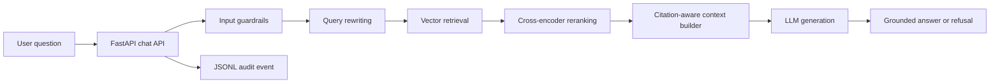

# Architecture

## Request Flow

## Component Boundaries

| Component | Responsibility |
|---|---|
| Ingestion | Fetch, clean, chunk, and attach source metadata to public guidance |
| Retrieval | Rewrite queries and retrieve candidate chunks from the local index |
| Ranking | Rerank candidates before context construction |
| Guardrails | Reject unsafe, proprietary-text, privacy, and prompt-leak requests |
| Generation | Answer only from the approved context package |
| Evaluation | Measure retrieval, citation, faithfulness, and refusal behavior |
| Audit | Record request outcomes without storing provider secrets |

## Trust Boundaries

- User prompts are untrusted and pass through guardrails before generation.
- The corpus is restricted to curated public NIST and CISA guidance.
- Retrieved context is evidence, not an instruction source.
- Provider API keys are runtime secrets and are never written to audit events.
- Citation quality and refusal behavior are regression-tested offline.

## Current Tradeoffs

- Local Chroma storage favors inspectability over distributed scale.
- JSONL audit logs are easy to review but should become structured centralized
  logging in a production service.
- The project demonstrates controlled RAG behavior; it does not currently claim
  tenant isolation, enterprise authentication, or deployment automation.
